# GenU Updates and Parameter Changes
This guide explains how to update GenU and change parameters after deploying with one-click deployment. For detailed parameters supported by GenU, please refer to the [GenU Documentation](https://aws-samples.github.io/generative-ai-use-cases/en/ABOUT.html).

The following steps will be performed:  
- Check auto-generated parameters from one-click deployment in Parameter Store  
- Set up development environment with SageMaker Code Editor  
- Use CDK for updates and parameter changes  

## Check Auto-Generated Parameters from One-Click Deployment

In one-click deployment, the parameters used during GenU deployment are stored in AWS Systems Manager Parameter Store in JSON format.

Open the [AWS Systems Manager Parameter Store console](https://ap-northeast-1.console.aws.amazon.com/systems-manager/parameters) and check the parameters. By default, they are created in the Tokyo region, but if you changed it, check in the destination region.

The following parameters are stored with the Environment name specified during deployment (default is dev)  
- `/genu/dev.json` - All parameters for dev environment stored in JSON format  
- `/genu/staging.json` - Parameters for staging environment (if deployed)  
- `/genu/prod.json` - Parameters for prod environment (if deployed)  


The parameter content is stored in JSON format as follows:

```json
{
  "modelRegion": "us-east-1",
  "modelIds": [
    "us.anthropic.claude-sonnet-4-20250514-v1:0",
    "us.anthropic.claude-opus-4-20250514-v1:0",
    "us.deepseek.r1-v1:0",
    "us.anthropic.claude-3-7-sonnet-20250219-v1:0",
    "us.anthropic.claude-3-5-haiku-20241022-v1:0",
    "us.amazon.nova-premier-v1:0",
    "us.amazon.nova-pro-v1:0",
    "us.amazon.nova-lite-v1:0",
    "us.amazon.nova-micro-v1:0"
  ],
  "ragKnowledgeBaseEnabled": true,
  "selfSignUpEnabled": false,
  "allowedSignUpEmailDomains": [
    "gmail.com"
  ],
  "allowedIpV4AddressRanges": null,
  "allowedIpV6AddressRanges": null
}
```

Here's an example of the management console screen:  
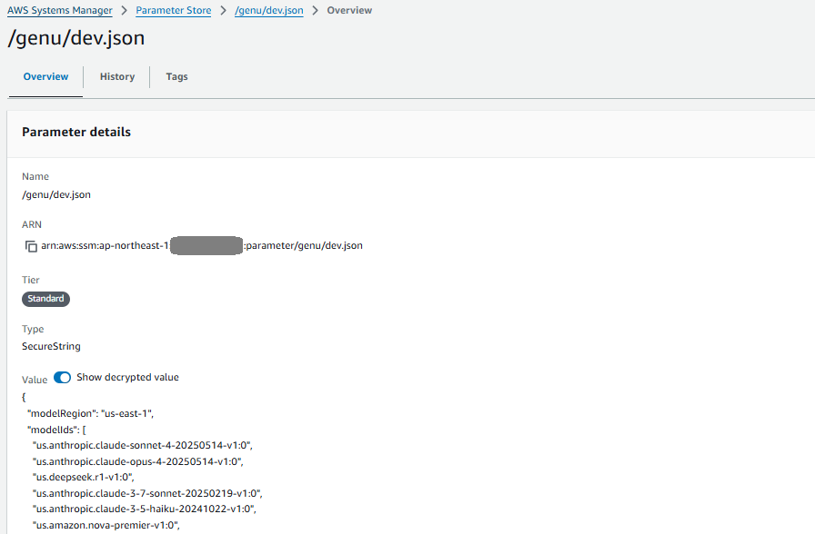

Using this JSON data, you can check and change parameters by applying them to the corresponding environment section in the following steps.

## Set Up Development Environment with SageMaker Code Editor
To update the GenU environment, we use SageMaker Code Editor. Create it using CloudFormation from the following link. If you intentionally changed the GenU deployment region from the default Tokyo, also change the SageMaker Code Editor deployment destination region. If you haven't changed it intentionally, please deploy to the Tokyo region from the URL below.  
Regarding pricing, when running the default ml.t3.medium in the Tokyo region, $0.065 per hour is charged. Code Editor automatically stops when no operations are performed for a certain period, providing cost optimization.

[](https://ap-northeast-1.console.aws.amazon.com/cloudformation/home?region=ap-northeast-1#/stacks/quickcreate?stackName=CodeEditorStack&templateURL=https://ws-assets-prod-iad-r-nrt-2cb4b4649d0e0f94.s3.ap-northeast-1.amazonaws.com/9748a536-3a71-4f0e-a6cd-ece16c0e3487/cloudformation/CodeEditorStack.template.yaml&param_UseDefaultVpc=true&param_EbsSizeInGb=20&param_InstanceType=ml.t3.medium&param_AutoStopIdleTimeInMinutes=180) 

CloudFormation will open, so check the box at the bottom of the screen and press Create stack.  
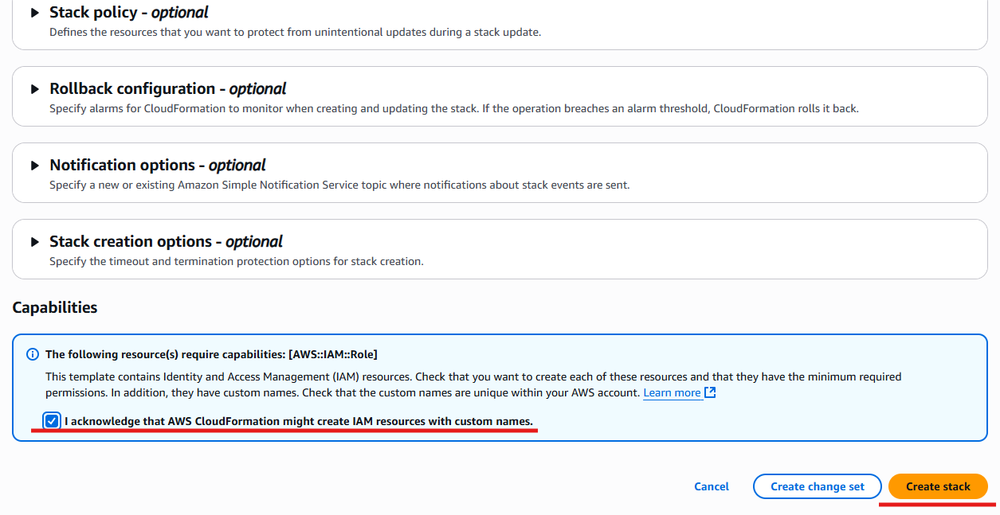

Stack creation begins and becomes CREATE_COMPLETE after about 7 minutes. Then open SageMakerStudioUrl from the Outputs tab.  


The SageMaker Studio AI screen opens, so press Skip.  
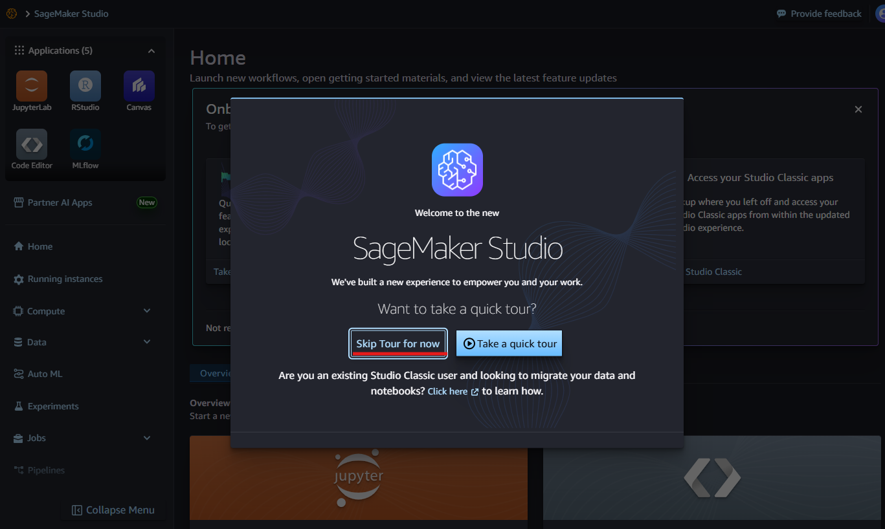

Open Code Editor and press Open. If it was stopped, start it first and then press Open.  
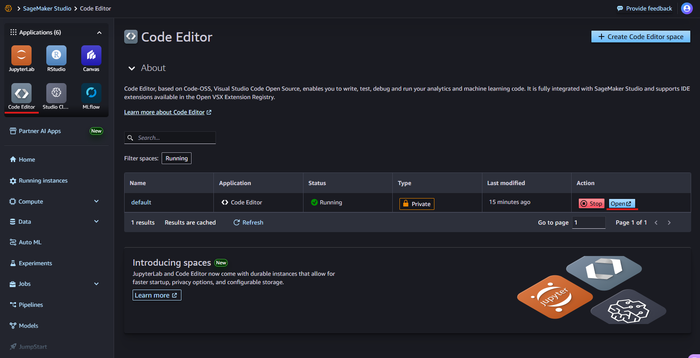

## Use CDK for Updates and Parameter Changes
The SageMaker Code Editor screen is now open. Press New Terminal.  


Execute the following command in the terminal to clone the latest GenU source code. By cloning the latest source code, GenU version upgrades are possible. For second and subsequent version upgrades where git clone has already been done, please refer to [these steps](#second-time-update).
```shell
git clone https://github.com/aws-samples/generative-ai-use-cases.git
```

Here's an image showing where to execute commands. As explained in the following image, the Terminal is displayed at the bottom of the screen, so execute commands here.  
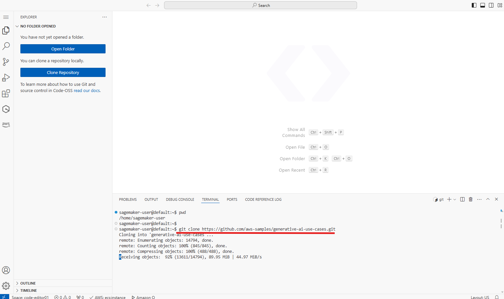

Open the cloned folder.  
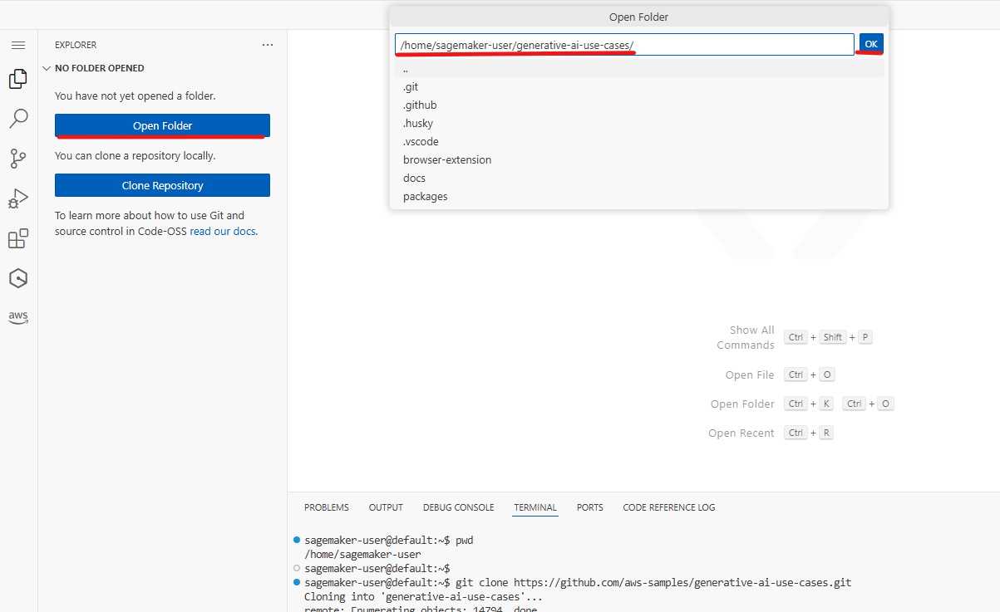

Press Yes, I trust the authors.  
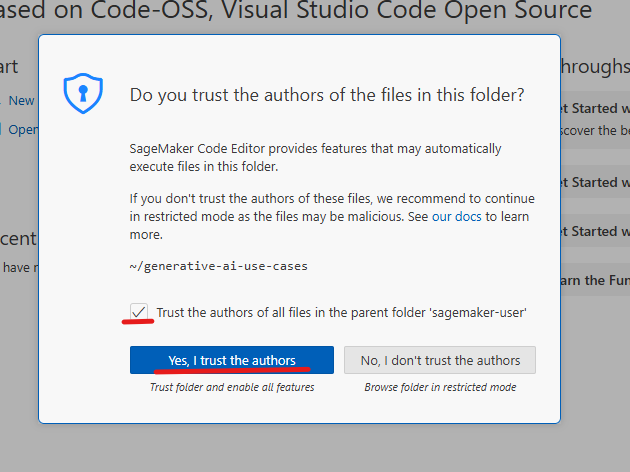

Open `packages/cdk/parameter.ts`.  
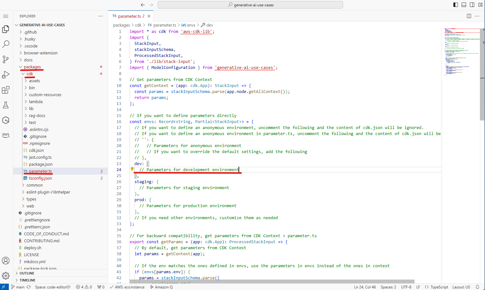

Again, press New Terminal to open the Terminal.  


Move to the directory where GenU was cloned.  
```shell
cd /home/sagemaker-user/generative-ai-use-cases/
```

Edit the `parameter.ts` file using the Parameter Store values confirmed in the previous step.  
For environments using the default dev, automatic configuration using commands is possible.  
Look at the Parameter Store names (`/genu/dev.json`, `/genu/staging.json`, `/genu/prod.json`) and if using `dev`, execute the following commands.  
If using environments other than `dev`, manually copy and paste the Parameter Store values to directly edit the `parameter.ts` file.

If using `dev`, retrieve data from Parameter Store and store it in the variable PARAMS.  

```shell
PARAMS=$(aws ssm get-parameter --name "/genu/dev.json" --query "Parameter.Value" --output text)
```

Next, execute the following command to edit the `parameter.ts` file.  

```shell
node -e "
const fs = require('fs');
const params = $PARAMS;
let content = fs.readFileSync('packages/cdk/parameter.ts', 'utf8');
const devStart = content.indexOf('dev: {');
const devEnd = content.indexOf('},', devStart) + 2;
const jsonString = JSON.stringify(params, null, 2);
const indentedJson = jsonString.split('\n').map((line, index) => {
  if (index === 0) return line;
  return '  ' + line;
}).join('\n');
const newDevSection = 'dev: ' + indentedJson + ',';
content = content.substring(0, devStart) + newDevSection + content.substring(devEnd);
fs.writeFileSync('packages/cdk/parameter.ts', content);
"
```

The dev file content should be edited as follows:  

```ts
  dev: {
    "modelRegion": "us-east-1",
    "modelIds": [
      "us.anthropic.claude-sonnet-4-20250514-v1:0",
      "us.anthropic.claude-opus-4-20250514-v1:0",
      "us.deepseek.r1-v1:0",
      "us.anthropic.claude-3-7-sonnet-20250219-v1:0",
      "us.anthropic.claude-3-5-haiku-20241022-v1:0",
      "us.amazon.nova-premier-v1:0",
      "us.amazon.nova-pro-v1:0",
      "us.amazon.nova-lite-v1:0",
      "us.amazon.nova-micro-v1:0"
    ],
    "ragKnowledgeBaseEnabled": true,
    "selfSignUpEnabled": false,
    "allowedSignUpEmailDomains": [
      "gmail.com"
    ],
    "allowedIpV4AddressRanges": null,
    "allowedIpV6AddressRanges": null
  },
  staging: {
    // Parameters for staging environment
  },
  prod: {
    // Parameters for production environment
  },
```

This is an example of the screen after editing.  
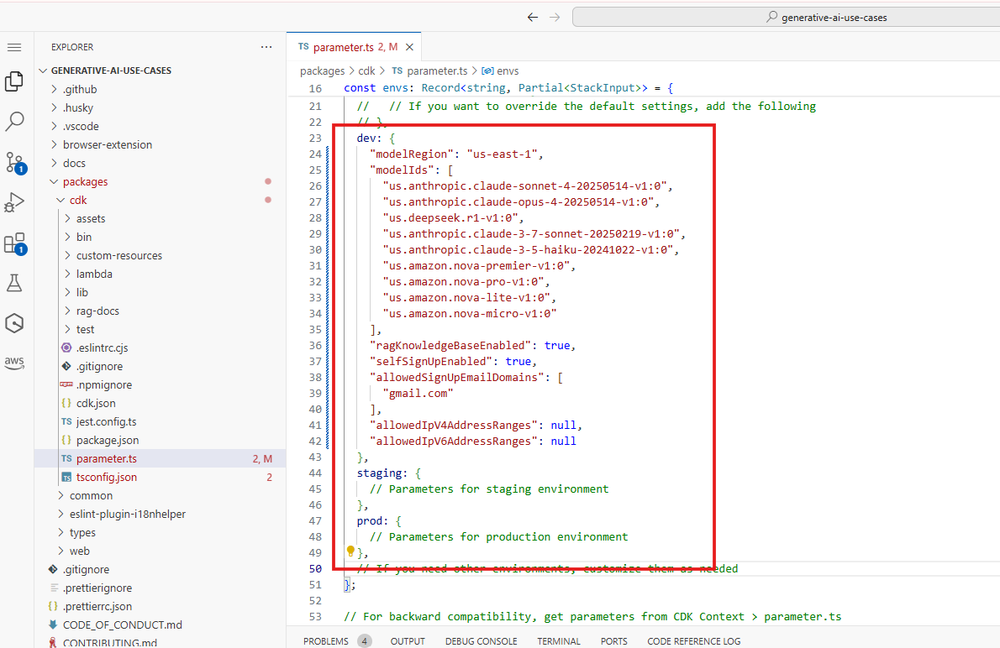

Let's change the parameters. In this procedure, we will change the models to use.  
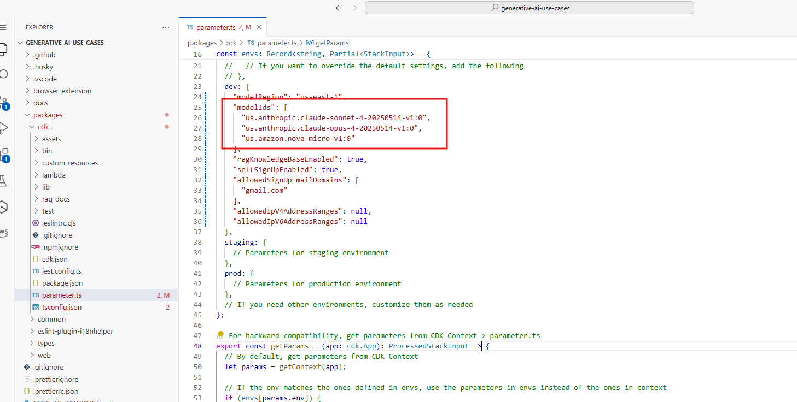

Resolve dependencies.  
```shell
npm ci
```

Execution example  
```shell
sagemaker-user@default:~/generative-ai-use-cases$ npm ci
npm warn deprecated sourcemap-codec@1.4.8: Please use @jridgewell/sourcemap-codec instead
npm warn deprecated rimraf@3.0.2: Rimraf versions prior to v4 are no longer supported
npm warn deprecated inflight@1.0.6: This module is not supported, and leaks memory. Do not use it. Check out lru-cache if you want a good and tested way to coalesce async requests by a key value, which is much more comprehensive and powerful.
npm warn deprecated glob@7.2.3: Glob versions prior to v9 are no longer supported
npm warn deprecated @humanwhocodes/object-schema@2.0.3: Use @eslint/object-schema instead
npm warn deprecated @humanwhocodes/config-array@0.13.0: Use @eslint/config-array instead
npm warn deprecated eslint@8.57.1: This version is no longer supported. Please see https://eslint.org/version-support for other options.

> generative-ai-use-cases@4.2.7 prepare
> husky


added 2416 packages, and audited 2461 packages in 2m

477 packages are looking for funding
  run `npm fund` for details

3 moderate severity vulnerabilities

To address all issues (including breaking changes), run:
  npm audit fix --force

Run `npm audit` for details.
npm notice
npm notice New minor version of npm available! 11.3.0 -> 11.4.1
npm notice Changelog: https://github.com/npm/cli/releases/tag/v11.4.1
npm notice To update run: npm install -g npm@11.4.1
npm notice
sagemaker-user@default:~/generative-ai-use-cases$ 
```

Update GenU. The `env=dev` parameter specifies the Environment name you want to deploy. The default is dev.  

```shell
npm run cdk:deploy:quick -- -c env=dev
```

Execution example  

```shell
sagemaker-user@default:~/generative-ai-use-cases$ npm run cdk:deploy:quick -- -c env=dev

> generative-ai-use-cases@4.2.7 cdk:deploy:quick
> npm -w packages/cdk run cdk deploy -- --all --asset-parallelism --asset-prebuild=false --concurrency 3 --method=direct --require-approval never --force -c env=dev


> cdk
> cdk deploy --all --asset-parallelism --asset-prebuild=false --concurrency 3 --method=direct --require-approval never --force -c env=dev

`cdk synth` may hang in Docker on Linux 5.6-5.10. See https://github.com/aws/aws-cdk/issues/21379 for workarounds.
Bundling asset GenerativeAiUseCasesStackdev/API/Predict/Code/Stage...

  packages/cdk/cdk.out/bundling-temp-d7718a9e133c5da897e2705c0897279a63ba1441a740635cdf58a04513f40f3e-building/index.js  3.3mb ⚠️

⚡ Done in 438ms

added 114 packages, and audited 120 packages in 5s

3 packages are looking for funding
  run `npm fund` for details

found 0 vulnerabilities

```

After some time, deployment is complete. The original GenU has been updated.  

```shell
GenerativeAiUseCasesStackdev.WebUrl = https://xxxxxxxxx.cloudfront.net
Stack ARN:
arn:aws:cloudformation:us-east-1:xxxxxxxxxx:stack/GenerativeAiUseCasesStackdev/83dbd1f0-3ecb-11f0-a659-0e0290ae6345

✨  Total time: 378.4s

sagemaker-user@default:~/generative-ai-use-cases$ 
```

## Steps for Updating GenU from the Second Time Onwards {#second-time-update}
This section introduces the steps for updating GenU from the second time onwards using SageMaker Code Editor. While the first time used git clone, the second time onwards has different steps since it's already cloned.  
After opening SageMaker Code Editor, open the GenU directory with Open Folder.

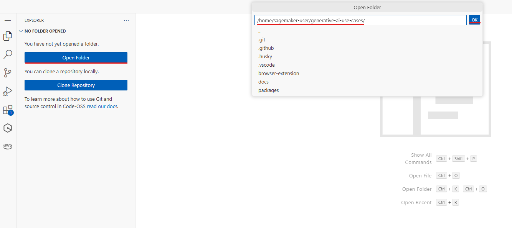

Open `packages/cdk/parameter.ts` and note down the values of `dev`, `staging`, and `prod`. **Be careful not to forget to take notes, as recovery is difficult if lost!**  


Move to the git cloned directory.  

```shell
cd /home/sagemaker-user/generative-ai-use-cases/
```

Reset all file contents edited in Code Editor to their original state. Please note that if you have edited files other than `parameter.ts`, they will all be lost.

```shell
git reset --hard
```

Get the latest version source code with the following command:

```shell
git pull
```

Resolve dependencies with npm ci:

```shell
npm ci
```

Edit the `parameter.ts` file. Restore the previously saved values of `dev`, `staging`, and `prod`.  


Update GenU. The `env=dev` parameter specifies the Environment name you want to deploy. The default is dev.  

```shell
npm run cdk:deploy:quick -- -c env=dev
```

The update is now complete!
